<!-- ═══════════════════════════════════════════════════════════════
     DIVAAN KRISHNAN · GitHub Profile README
     Replace every `chika0853` with your real GitHub username.
     ═══════════════════════════════════════════════════════════════ -->

<div align="center">


<a href="https://chika0853.netlify.app">
  
</a>

<br/>

<a href="https://divaankrishnan.netlify.app"></a>
<a href="https://linkedin.com/in/YOUR-HANDLE"></a>
<a href="https://www.credly.com/users/divaan-krishnan"></a>
<a href="mailto:divaankrishnan@gmail.com"></a>


</div>

<br/>

<!-- ─────────────────────────── ABOUT ─────────────────────────── -->


### `~/ whoami`

```ts
const divaan = {
  role      : "Full-Stack Developer",
  location  : "Puchong, Malaysia 🇲🇾",
  focus     : ["Premium UI/UX", "Animation-first web", "Shipping real products"],
  building  : "Qymon — household essentials, engineered on the web",
  stack     : ["Vanilla JS", "React", "Node.js", "Supabase", "SVG", "PWA"],
  certified : "IBM",
  philosophy: "If it doesn't feel good to use, it isn't finished.",
};
```

- 🟣 Currently architecting **Qymon** — a production web platform with live Supabase data, PWA install flow, and scroll-driven 3D product visuals
- 🎨 I care about the details most people scroll past — easing curves, reveal timing, hover weight
- 🧪 Hand-crafting SVG and single-file apps because constraints make better engineers
- 📫 Reach me at **[divaankrishnan.netlify.app](https://divaankrishnan.netlify.app)**

<br clear="right"/>

<!-- ─────────────────────────── STACK ─────────────────────────── -->

## 🛠️ Tech Arsenal

<div align="center">

**Core**


**Backend · Data · Tools**


</div>

<br/>

<!-- ─────────────────────────── STATS ─────────────────────────── -->

## 📊 The Numbers

<div align="center">




<br/>


<br/><br/>


<br/>


</div>

<br/>

<!-- ─────────────────────────── PROJECTS ─────────────────────────── -->

## 🚀 Featured Work

<div align="center">
<table>
<tr>
<td width="50%" valign="top">

### 🟣 Qymon
Production web platform for a household essentials brand. Live Supabase product catalogue, inquiry pipeline, PWA install, and scroll-choreographed 3D product reveals — all shipped in a single hand-written file.

`Vanilla JS` `Supabase` `PWA`

</td>
<td width="50%" valign="top">

### 🎯 Portfolio
A personal site built on the bones of IBM's Carbon design language. Type-driven, grid-strict, credential-backed.

[**Live →**](https://chika0853.netlify.app)

`Carbon` `HTML/CSS/JS`

</td>
</tr>
</table>
</div>

<br/>

<!-- ─────────────────────────── SNAKE ─────────────────────────── -->

<div align="center">


<br/><br/>

> *"Simplicity is the ultimate sophistication."*


</div>
